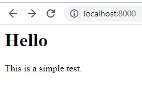

# Buku

[Deno Site](https://adilima-buku.deno.dev/)

If all we want is to write our documentations, and then share them somewhere,
why should we mess up with something else. We should use MDX format, and Deno.

```jsx
import {serve} from 'https://deno.land/std@0.179.0/http/server.ts';
import React from 'https://esm.sh/stable/react@18.2.0/es2022/react.js';
import {renderToString} from 'https://esm.sh/v111/react-dom@18.2.0/es2022/server.js';

const SayHello = (props) => {
    return (
        <div>
            <h1>{props.title}</h1>
            <p>{props.details}</p>
        </div>
    );
}

const handler = async (request) => {
    const html = renderToString(<SayHello title="Hello" details="This is a simple test." />);
    return new Response(html, {
        status: 200,
        headers: {
            "content-type": "text/html"
        }
    })
};

serve(handler);
```

Then run it locally.

```console
deno run -A tests/simple.jsx
```



